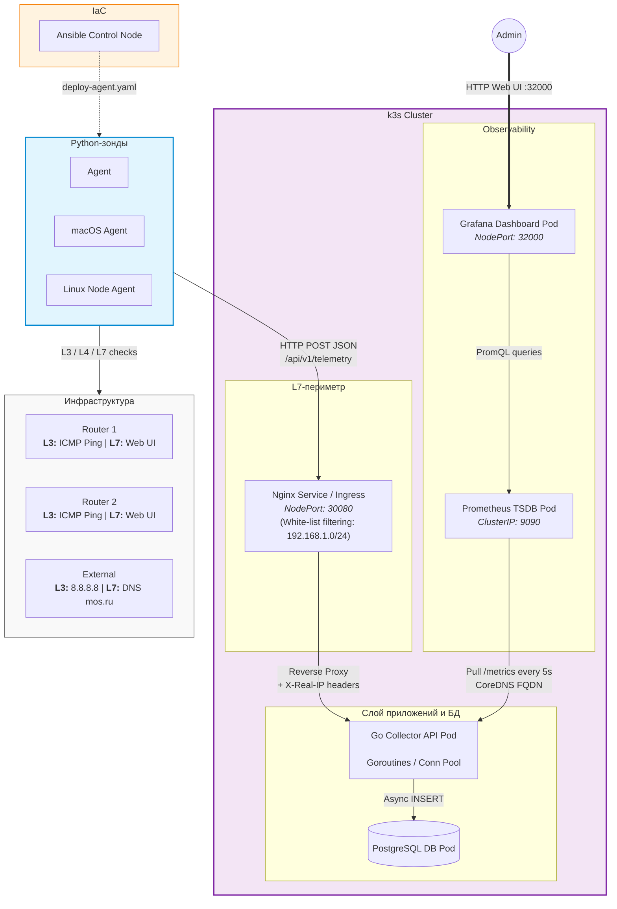

# meshmonitor

Система мониторинга сетевой связности локальной сети

## Описание

Распределенная система с гибридной схемой:
1. **push** агенты на python проверяют состояние сети и отправляют json на центральный коллектов
2. **pull** grafana получает данные из БД коллектора и prometheus

## Архитектура



### Покрытие слоев

| Слой OSI | Объекты проверки | Инструмент зондирования | Описание / Назначение |
| :--- | :--- | :--- | :--- |
| **L3 Network** | Роутеры, external WAN (8.8.8.8) | System `ping` (ICMP) | Анализ латентности, потерь пакетов и коллизий |
| **L4 Transport** | k3s NodePort (30080), SSH (22), Postgres (5432) | Non-blocking TCP Sockets | Контроль доступности транспортных портов и служб |
| **L7 Application** | Web UI роутеров, DNS resolution | `http.client` & `socket` | Замер времени отклика веб-демонов и скорости работы DNS |

### Стек

* **Backend**: Сборщик метрик на Go
* **Containerization**: Multi-stage `Dockerfile` на базе `alpine`
* **Orchestration**: Кластер k3s. Все компоненты системы упакованы в Helm-чарт
* **Observability**: `prometheus/client_golang`. Grafana (State Timeline, Bar Gauges, Row Isolation)
* **Synthetic Probe Agent**: Python скрипт на стандартной библиотеке (`socket`, `urllib`, `subprocess`) 
* **IaC**: Ansible

## Быстрый старт

### Prerequisites

k3s (minikube/kind), helm, docker, python3

### 1. Кластер k3s

```bash
docker build -t collector:latest -f deploy/docker/Dockerfile .
sudo k3s ctr images import --namespace k8s.io collector.tar
helm install mesh-monitor ./deploy/helm/mesh-monitor
```

### 2. Локальный агент 

```bash
python3 scripts/agent.py
```

## Дашборд Grafana

Дашборд структурирован по секциям:
1. **Global Health**: Задержка до роутеров и Интернета и матрица доступности для обнаружения аварий
2. **Infrastructure**: Статус портов кластера, скорость DNS и доступность HTTP интерфейсов роутеров

## STAR

WIP
